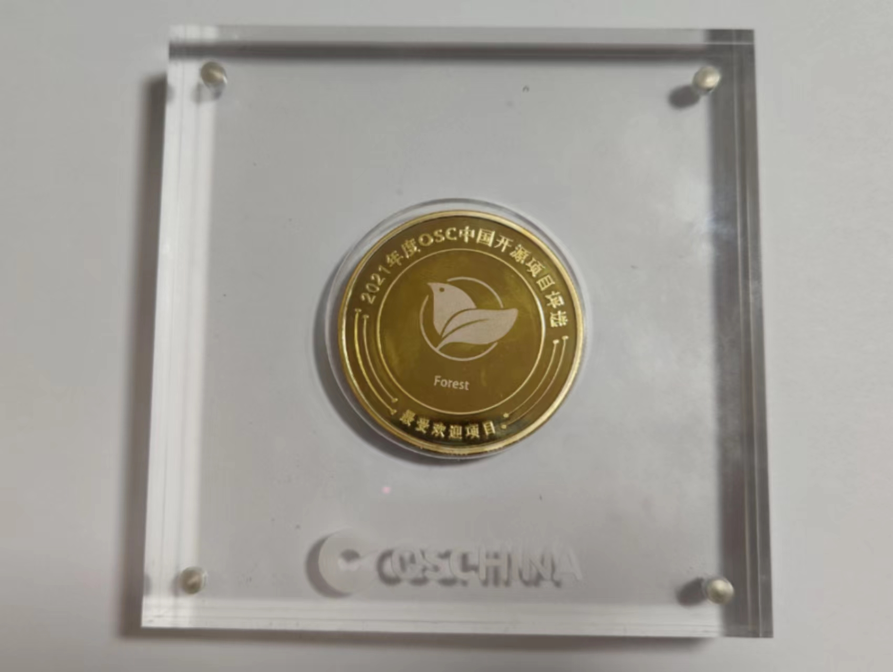

<p align="center">
<a href="http://forest.dtflyx.com/">
    
</a>
</p>


<p align="center">
<a href="https://gitee.com/dromara/forest">
    
</a>
<a href="https://www.oracle.com/java/technologies/javase/javase-jdk8-downloads.html">
    
</a>

<a href="https://opensource.org/licenses/mit-license.php">
    
</a>
<a href="http://forest.dtflyx.com/">
    
</a>
<a href="https://gitee.com/dromara/forest#%E8%81%94%E7%B3%BB%E4%BD%9C%E8%80%85">
    
</a>
</p>

<h1 align="center">Forest - 声明式HTTP客户端框架</h1>

项目介绍：
-------------------------------------

Forest是一个高层的、极简的声明式HTTP调用API框架<br>
相比于直接使用Httpclient您不再用写一大堆重复的代码了，而是像调用本地方法一样去发送HTTP请求


#### 获得荣誉

- **2021 年度 OSC 中国开源项目评选「最受欢迎项目」**
- **2022 年度 OSC 中国开源项目评选「最火热中国开源项目社区」**

文档和示例：
-------------------------------------
* [项目主页](http://forest.dtflyx.com/) 

* [中文文档](https://forest.dtflyx.com/pages/1.5.33/intro/) 

* [JavaDoc](https://apidoc.gitee.com/dt_flys/forest/)

* [示例工程](forest-examples)

Forest有哪些特性？
-----
* 以Httpclient和OkHttp为后端框架
* 通过调用本地方法的方式去发送Http请求, 实现了业务逻辑与Http协议之间的解耦
* 因为针对第三方接口，所以不需要依赖Spring Cloud和任何注册中心
* 支持所有请求方法：GET, HEAD, OPTIONS, TRACE, POST, DELETE, PUT, PATCH
* 支持文件上传和下载
* 支持灵活的模板表达式
* 支持拦截器处理请求的各个生命周期
* 支持自定义注解
* 支持OAuth2验证
* 支持过滤器来过滤传入的数据
* 基于注解、配置化的方式定义Http请求
* 支持Spring和Springboot集成
* JSON格式数据序列化和反序列化
* XML格式数据序列化和反序列化
* Protobuf格式数据序列化和反序列化
* JSON、XML或其他类型转换器可以随意扩展和替换
* 支持JSON转换框架: Fastjson, Jackson, Gson
* 支持JAXB形式的XML转换
* 可以通过OnSuccess和OnError接口参数实现请求结果的回调
* 配置简单，一般只需要@Request一个注解就能完成绝大多数请求的定义
* 支持异步请求调用

极速开始
-------------------------------------
以下例子基于Spring Boot

### 第一步：添加Maven依赖

直接添加以下maven依赖即可

```xml
<dependency>
    <groupId>com.dtflys.forest</groupId>
    <artifactId>forest-spring-boot-starter</artifactId>
    <version>1.5.36</version>
</dependency>
```

### 第二步：创建一个`interface`

就以高德地图API为栗子吧

```java

package com.yoursite.client;

import com.dtflys.forest.annotation.Request;
import com.dtflys.forest.annotation.DataParam;

public interface AmapClient {

    /**
     * 聪明的你一定看出来了@Get注解代表该方法专做GET请求
     * 在url中的{0}代表引用第一个参数，{1}引用第二个参数
     */
    @Get("http://ditu.amap.com/service/regeo?longitude={0}&latitude={1}")
    Map getLocation(String longitude, String latitude);
}

```

### 第三步：扫描接口

在Spring Boot的配置类或者启动类上加上`@ForestScan`注解，并在`basePackages`属性里填上远程接口的所在的包名

```java
@SpringBootApplication
@Configuration
@ForestScan(basePackages = "com.yoursite.client")
public class MyApplication {
  public static void main(String[] args) {
      SpringApplication.run(MyApplication.class, args);
   }
}
```

### 第四步：调用接口

OK，我们可以愉快地调用接口了

```java
// 注入接口实例
@Autowired
private AmapClient amapClient;
...
// 调用接口
Map result = amapClient.getLocation("121.475078", "31.223577");
System.out.println(result);
```

## 发送JSON数据

```java
/**
 * 将对象参数解析为JSON字符串，并放在请求的Body进行传输
 */
@Post("/register")
String registerUser(@JSONBody MyUser user);

/**
 * 将Map类型参数解析为JSON字符串，并放在请求的Body进行传输
 */
@Post("/test/json")
String postJsonMap(@JSONBody Map mapObj);

/**
 * 直接传入一个JSON字符串，并放在请求的Body进行传输
 */
@Post("/test/json")
String postJsonText(@JSONBody String jsonText);
```

## 发送XML数据

```java
/**
 * 将一个通过JAXB注解修饰过的类型对象解析为XML字符串
 * 并放在请求的Body进行传输
 */
@Post("/message")
String sendXmlMessage(@XMLBody MyMessage message);

/**
 * 直接传入一个XML字符串，并放在请求的Body进行传输
 */
@Post("/test/xml")
String postXmlBodyString(@XMLBody String xml);
```

## 发送Protobuf数据

```java
/**
 * ProtobufProto.MyMessage 为 Protobuf 生成的数据类
 * 将 Protobuf 生成的数据对象转换为 Protobuf 格式的字节流
 * 并放在请求的Body进行传输
 * 
 * 注: 需要引入 google protobuf 依赖
 */
@Post(url = "/message", contentType = "application/octet-stream")
String sendProtobufMessage(@ProtobufBody ProtobufProto.MyMessage message);
```


## 文件上传

```java
/**
 * 用@DataFile注解修饰要上传的参数对象
 * OnProgress参数为监听上传进度的回调函数
 */
@Post("/upload")
Map upload(@DataFile("file") String filePath, OnProgress onProgress);
```

可以用一个方法加Lambda同时解决文件上传和上传的进度监听

```java
Map result = myClient.upload("D:\\TestUpload\\xxx.jpg", progress -> {
    System.out.println("progress: " + Math.round(progress.getRate() * 100) + "%");  // 已上传百分比
    if (progress.isDone()) {   // 是否上传完成
        System.out.println("--------   Upload Completed!   --------");
    }
});
```

## 多文件批量上传

```java
/**
 * 上传Map包装的文件列表，其中 {_key} 代表Map中每一次迭代中的键值
 */
@Post("/upload")
ForestRequest<Map> uploadByteArrayMap(@DataFile(value = "file", fileName = "{_key}") Map<String, byte[]> byteArrayMap);

/**
 * 上传List包装的文件列表，其中 {_index} 代表每次迭代List的循环计数（从零开始计）
 */
@Post("/upload")
ForestRequest<Map> uploadByteArrayList(@DataFile(value = "file", fileName = "test-img-{_index}.jpg") List<byte[]> byteArrayList);
```

## 文件下载

下载文件也是同样的简单

```java
/**
 * 在方法上加上@DownloadFile注解
 * dir属性表示文件下载到哪个目录
 * OnProgress参数为监听上传进度的回调函数
 * {0}代表引用第一个参数
 */
@Get("http://localhost:8080/images/xxx.jpg")
@DownloadFile(dir = "{0}")
File downloadFile(String dir, OnProgress onProgress);
```


调用下载接口以及监听下载进度的代码如下：

```java
File file = myClient.downloadFile("D:\\TestDownload", progress -> {
    System.out.println("progress: " + Math.round(progress.getRate() * 100) + "%");  // 已下载百分比
    if (progress.isDone()) {   // 是否下载完成
        System.out.println("--------   Download Completed!   --------");
    }
});
```

## 基本签名验证

```java
@Post("/hello/user?username={username}")
@BasicAuth(username = "{username}", password = "bar")
String send(@DataVariable("username") String username);
```

## OAuth 2.0

```java
@OAuth2(
        tokenUri = "/auth/oauth/token",
        clientId = "password",
        clientSecret = "xxxxx-yyyyy-zzzzz",
        grantType = OAuth2.GrantType.PASSWORD,
        scope = "any",
        username = "root",
        password = "xxxxxx"
)
@Get("/test/data")
String getData();
```

## 自定义注解

Forest允许您根据需要自行定义注解，不但让您可以简单优雅得解决各种需求，而且极大得扩展了Forest的能力。

### 定义一个注解

```java
/**
 * 用Forest自定义注解实现一个自定义的签名加密注解
 * 凡用此接口修饰的方法或接口，其对应的所有请求都会执行自定义的签名加密过程
 * 而自定义的签名加密过程，由这里的@MethodLifeCycle注解指定的生命周期类进行处理
 * 可以将此注解用在接口类和方法上
 */
@Documented
/** 重点： @MethodLifeCycle注解指定该注解的生命周期类*/
@MethodLifeCycle(MyAuthLifeCycle.class)
@RequestAttributes
@Retention(RetentionPolicy.RUNTIME)
/** 指定该注解可用于类上或方法上 */
@Target({ElementType.TYPE, ElementType.METHOD})
public @interface MyAuth {

    /** 
     * 自定义注解的属性：用户名
     * 所有自定注解的属性可以在生命周期类中被获取到
     */
    String username();

    /** 
     * 自定义注解的属性：密码
     * 所有自定注解的属性可以在生命周期类中被获取到
     */
    String password();
}
```

### 定义注解生命周期类

```java
/**
 *  MyAuthLifeCycle 为自定义的 @MyAuth 注解的生命周期类
 * 因为 @MyAuth 是针对每个请求方法的，所以它实现自 MethodAnnotationLifeCycle 接口
 * MethodAnnotationLifeCycle 接口带有泛型参数
 * 第一个泛型参数是该生命周期类绑定的注解类型
 * 第二个泛型参数为请求方法返回的数据类型，为了尽可能适应多的不同方法的返回类型，这里使用 Object
 */
public class MyAuthLifeCycle implements MethodAnnotationLifeCycle<MyAuth, Object> {

 
    /**
     * 当方法调用时调用此方法，此时还没有执行请求发送
     * 次方法可以获得请求对应的方法调用信息，以及动态传入的方法调用参数列表
     */
    @Override
    public void onInvokeMethod(ForestRequest request, ForestMethod method, Object[] args) {
        System.out.println("Invoke Method '" + method.getMethodName() + "' Arguments: " + args);
    }

    /**
     * 发送请求前执行此方法，同拦截器中的一样
     */
    @Override
    public boolean beforeExecute(ForestRequest request) {
        // 通过getAttribute方法获取自定义注解中的属性值
        // getAttribute第一个参数为request对象，第二个参数为自定义注解中的属性名
        String username = (String) getAttribute(request, "username");
        String password = (String) getAttribute(request, "password");
        // 使用Base64进行加密
        String basic = "MyAuth " + Base64Utils.encode("{" + username + ":" + password + "}");
        // 调用addHeader方法将加密结构加到请求头MyAuthorization中
        request.addHeader("MyAuthorization", basic);
        return true;
    }

    /**
     * 此方法在请求方法初始化的时候被调用
     */
    @Override
    public void onMethodInitialized(ForestMethod method, BasicAuth annotation) {
        System.out.println("Method '" + method.getMethodName() + "' Initialized, Arguments: " + args);
    }
}
```

### 使用自定义的注解

```java
/**
 * 在请求接口上加上自定义的 @MyAuth 注解
 * 注解的参数可以是字符串模板，通过方法调用的时候动态传入
 * 也可以是写死的字符串
 */
@Get("/hello/user?username={username}")
@MyAuth(username = "{username}", password = "bar")
String send(@DataVariable("username") String username);
```

#### 详细文档请看：[官方文档](http://forest.dtflyx.com/)


## 获得奖项



> 2021 年度 OSC 中国开源项目评选「最受欢迎项目」


## 联系作者

亲，进群前记得先star一下哦~

扫描二维码关注公众号，点击菜单中的 `进群` 按钮即可进群


他们在用
-----------------------------------
已在使用Forest的公司列表（排名不分先后）
<table>
<tr>
<td></td>
<td></td>
<td></td>
<td></td>
<td></td>
</tr>
<tr>
<td></td>
<td></td>
<td></td>
<td></td>
<td></td>
</tr>
<tr>
<td></td>
<td></td>
<td></td>
<td></td>
<td></td>
</tr>
<tr>
<td></td>
</tr>

</table>

参与贡献
-----------------------------------

1. 进群讨论，可以在群里抛出您遇到的问题，或许已经有人解决了您的问题。
2. 提issue，如果在gitee的issue中已经有您想解决的问题，可以直接将该issue分配给您自己。如若没有，可以自己在gitee上创建一个issue。
3. Fork 本项目的仓库
4. 新建分支，如果是加新特性，分支名格式为`feat_${issue的ID号}`，如果是修改bug，则命名为`fix_${issue的ID号}`。
5. 本地自测，提交前请通过所有的已经单元测试，以及为您要解决的问题新增单元测试。
6. 提交代码
7. 新建 Pull Request
8. 我会对您的PR进行验证和测试，如通过测试，我会合到`dev`分支上随新版本发布时再合到`master`分支上。

欢迎小伙伴们多提issue和PR，被接纳PR的小伙伴我会列在`README`上的贡献者列表中:）

项目协议
--------------------------
The MIT License (MIT)

Copyright (c) 2016 Jun Gong


