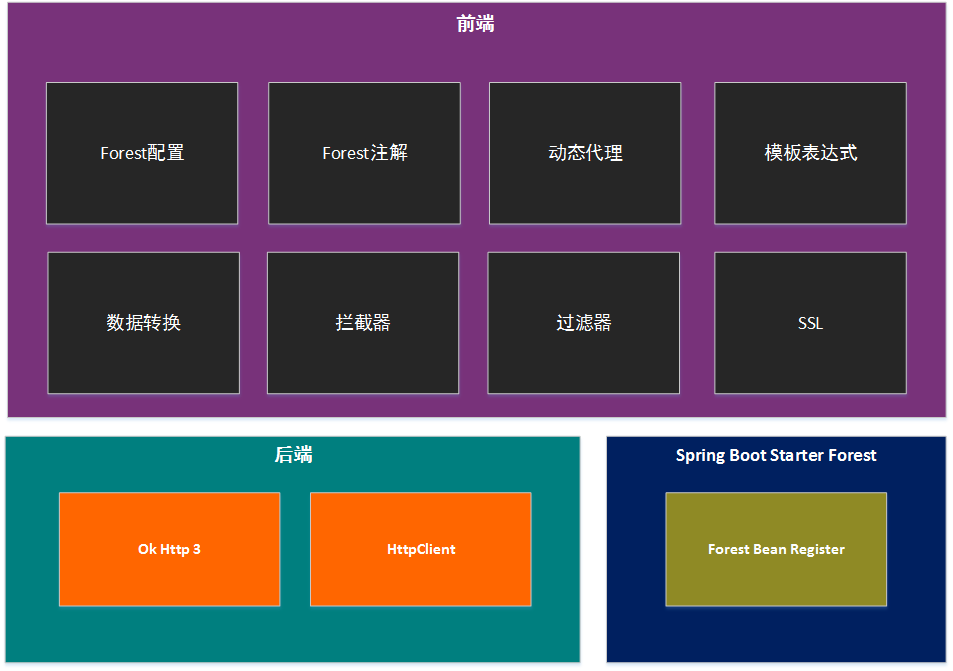
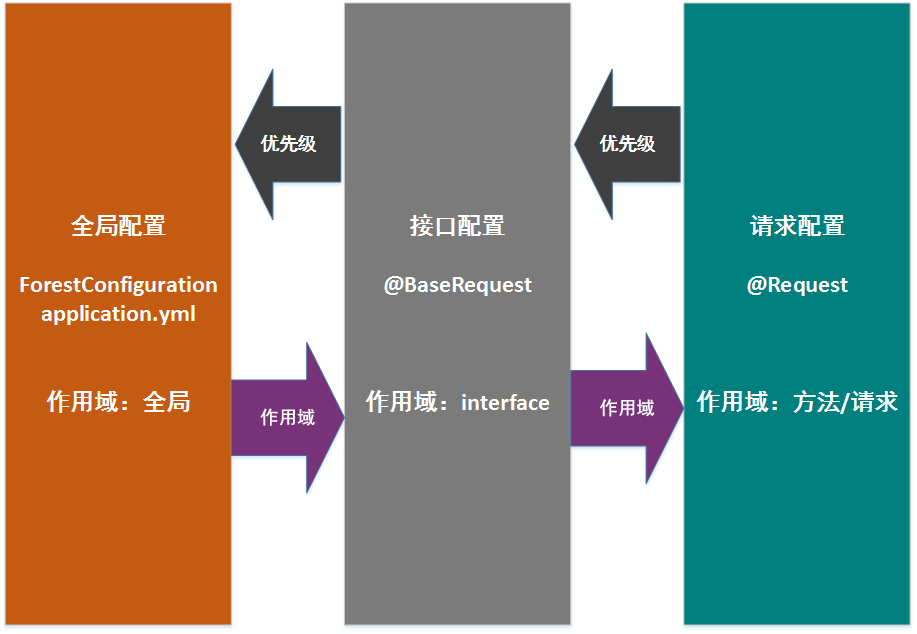

# 一. 新手介绍

## 什么是 Forest？

Forest 是一个开源的 Java HTTP 客户端框架，它能够将 HTTP 的所有请求信息（包括 URL、Header 以及 Body 等信息）绑定到您自定义的 Interface 方法上，能够通过调用本地接口方法的方式发送 HTTP 请求。

## 为什么使用 Forest?

使用 Forest 就像使用类似 Dubbo 那样的 RPC 框架一样，只需要定义接口，调用接口即可，不必关心具体发送 HTTP 请求的细节。同时将 HTTP 请求信息与业务代码解耦，方便您统一管理大量 HTTP 的 URL、Header 等信息。而请求的调用方完全不必在意 HTTP 的具体内容，即使该 HTTP 请求信息发生变更，大多数情况也不需要修改调用发送请求的代码。

## Forest 如何使用?

Forest 不需要您编写具体的 HTTP 调用过程，只需要您定义一个接口，然后通过 Forest 注解将 HTTP 请求的信息添加到接口的方法上即可。请求发送方通过调用您定义的接口便能自动发送请求和接受请求的响应。

## Forest 的工作原理

Forest 会将您定义好的接口通过动态代理的方式生成一个具体的实现类，然后组织、验证 HTTP 请求信息，绑定动态数据，转换数据形式，SSL 验证签名，调用后端 HTTP API(httpclient 等 API)执行实际请求，等待响应，失败重试，转换响应数据到 Java 类型等脏活累活都由这动态代理的实现类给包了。
请求方发送方调用这个接口时，实际上就是在调用这个干脏活累活的实现类。

## Forest 的架构



我们讲 HTTP 发送请求的过程分为前端部分和后端部分，Forest 本身是处理前端过程的框架，是对后端 HTTP API 框架的进一步封装。

<b>前端部分：</b>

1. Forest 配置： 负责管理 HTTP 发送请求所需的配置。
2. Forest 注解： 用于定义 HTTP 发送请求的所有相关信息，一般定义在 interface 上和其方法上。
3. 动态代理： 用户定义好的 HTTP 请求的`interface`将通过动态代理产生实际执行发送请求过程的代理类。
4. 模板表达式： 模板表达式可以嵌入在几乎所有的 HTTP 请求参数定义中，它能够将用户通过参数或全局变量传入的数据动态绑定到 HTTP 请求信息中。
5. 数据转换： 此模块将字符串数据和`JSON`或`XML`形式数据进行互转。目前 JSON 转换器支持`Jackson`、`Fastjson`、`Gson`三种，XML 支持`JAXB`一种。
6. 拦截器： 用户可以自定义拦截器，拦截指定的一个或一批请求的开始、成功返回数据、失败、完成等生命周期中的各个环节，以插入自定义的逻辑进行处理。
7. 过滤器： 用于动态过滤和处理传入 HTTP 请求的相关数据。
8. SSL： Forest 支持单向和双向验证的 HTTPS 请求，此模块用于处理 SSL 相关协议的内容。

<b>后端部分：</b>

后端为实际执行 HTTP 请求发送过程的第三方 HTTP API，目前支持`okHttp3`和`httpclient`两种后端 API。

<b>Spring Boot Starter Forest:</b>

提供对`Spring Boot`的支持

## 对应的 Java 版本

Forest 1.0.x 和 Forest 1.1.x 基于 JDK 1.7, Forest 1.2.x及以上版本基于 JDK 1.8

# 二. 安装

## 2.1 在 Spring Boot 项目中安装

若您的项目基于`Spring Boot`，那只要添加下面一个 maven 依赖便可。

```xml
<dependency>
    <groupId>com.dtflys.forest</groupId>
    <artifactId>spring-boot-starter-forest</artifactId>
    <version>1.3.0</version>
</dependency>
```

最新版本为<font color=red>_1.3.0_</font>，为稳定版本

## 2.2 在非 Spring Boot 项目中安装

先添加后端 HTTP API 的依赖：`okhttp3` 或 `httpclient`.
以及 JSON 解析框架：`Jackson`、`Fastjson`或`Gson`

```xml
<dependency>
  <groupId>com.squareup.okhttp3</groupId>
  <artifactId>okhttp</artifactId>
  <version>3.3.0</version>
</dependency>

<dependency>
    <groupId>com.alibaba</groupId>
    <artifactId>fastjson</artifactId>
    <version>1.2.47</version>
</dependency>
```

然后添加 Forest 核心包依赖

```xml
<dependency>
    <groupId>com.dtflys.forest</groupId>
    <artifactId>forest-core</artifactId>
    <version>1.3.0</version>
</dependency>
```

最新版本为<font color=red>_1.3.0_</font>，为稳定版本


# 三. 构建请求接口

在 Forest 依赖加入好之后，就可以构建 HTTP 请求的接口了。

在 Forest 中，所有的 HTTP 请求信息都要绑定到某一个接口的方法上，不需要编写具体的代码去发送请求。请求发送方通过调用事先定义好 HTTP 请求信息的接口方法，自动去执行 HTTP 发送请求的过程，其具体发送请求信息就是该方法对应绑定的 HTTP 请求信息。

## 3.1 简单请求

创建一个`interface`，并用`@Request`注解修饰接口方法。

```java
public interface MyClient {

    @Request(url = "http://localhost:5000/hello")
    String simpleRequest();

}
```

通过`@Request`注解，将上面的`MyClient`接口中的`simpleRequest()`方法绑定了一个 HTTP 请求，
其 URL 为`http://localhost:5000/hello`
，并默认使用`GET`方式，且将请求响应的数据以`String`的方式返回给调用者。

## 3.2 稍复杂点的请求

```java
public interface MyClient {

    @Request(
            url = "http://localhost:5000/hello/user",
            headers = "Accept: text/plan"
    )
    String sendRequest(@DataParam("uname") String username);
}
```

上面的`sendRequest`方法绑定的 HTTP 请求，定义了 URL 信息，以及把`Accept:text/plan`加到了请求头中，
方法的参数`String username`绑定了注解`@DataParam("uname")`，它的作用是将调用者传入入参 username 时，自动将`username`的值加入到 HTTP 的请求参数`uname`中。

如果调用方代码如下所示：

```java
MyClient myClient;
...
myClient.sendRequest("foo");
```

这段调用所实际产生的 HTTP 请求如下：

    GET http://localhost:5000/hello/user?uname=foo
    HEADER:
        Accept: text/plan

## 3.3 改变 HTTP Method

使用`POST`方式

```java
public interface MyClient {

    @Request(
            url = "http://localhost:5000/hello",
            type = "POST"
    )
    String simplePost();
}
```

如果上面代码所示，可以通过`@Request`注解的`type`参数指定 HTTP 请求的方式。

除了`GET`和`POST`，也可以指定成其他几种 HTTP 请求方式(`PUT`, `HEAD`, `OPTIONS`, `DELETE`)。

其中`type`属性的大小写不敏感，写成`POST`和`post`效果相同。

```java
public interface MyClient {

    // GET请求
    @Request(
            url = "http://localhost:5000/hello",
            type = "get"
    )
    String simpleGet();

    // POST请求
    @Request(
            url = "http://localhost:5000/hello",
            type = "post"
    )
    String simplePost();

    // PUT请求
    @Request(
            url = "http://localhost:5000/hello",
            type = "put"
    )
    String simplePut();

    // HEAD请求
    @Request(
            url = "http://localhost:5000/hello",
            type = "head"
    )
    String simpleHead();

    // Options请求
    @Request(
            url = "http://localhost:5000/hello",
            type = "options"
    )
    String simpleOptions();

    // Delete请求
    @Request(
            url = "http://localhost:5000/hello",
            type = "delete"
    )
    String simpleDelete();

}
```

## 3.4 设置 HTTP Header

在[4.2](##_42-稍复杂点的请求定义)的例子中，我们已经知道了可以通过`@Request`注解的`headers`属性设置一条 HTTP 请求头。

现在我们来看看如何添加多条请求头

其中`headers`属性接受的是一个字符串数组，在接受多个请求头信息时以以下形式填入请求头:

```java
{
    "请求头名称1: 请求头值1",
    "请求头名称2: 请求头值2",
    "请求头名称3: 请求头值3",
    ...
 }
```

其中组数每一项都是一个字符串，每个字符串代表一个请求头。请求头的名称和值用`:`分割。

具体代码请看如下示例：

```java
public interface MyClient {

    @Request(
            url = "http://localhost:5000/hello/user",
            headers = {
                "Accept-Charset: utf-8",
                "Content-Type: text/plain"
            }
    )
    String multipleHeaders();
}
```

该接口调用后所实际产生的 HTTP 请求如下：

    GET http://localhost:5000/hello/user
    HEADER:
        Accept-Charset: utf-8
        Content-Type: text/plain

如果要每次请求传入不同的请求头内容，可以在`headers`属性的请求头定义中加入`数据绑定`。

?> 如何进行数据绑定请参见 [五. 数据绑定](#五-数据绑定)

```java
public interface MyClient {

    @Request(
            url = "http://localhost:5000/hello/user",
            headers = {
                "Accept-Charset: ${encoding}",
                "Content-Type: text/plain"
            }
    )
    String bindingHeader(@DataVariable("encoding") String encoding);
}
```

如果调用方代码如下所示：

```java
myClient.bindingHeader("gbk");
```

这段调用所实际产生的 HTTP 请求如下：

    GET http://localhost:5000/hello/user
    HEADER:
        Accept-Charset: gbk
        Content-Type: text/plain

## 3.5 添加 HTTP Body

在`POST`和`PUT`等请求方法中，通常使用 HTTP 请求体进行传输数据。在 Forest 中有多种方式设置请求体数据。

### 3.5.1 通过 data 属性添加请求体

您可以通过`@Request`注解的`data`属性把数据添加到请求体。需要注意的是只有当`type`为`POST`、`PUT`、`PATCH`这类 HTTP Method 时，`data`属性中的值才会绑定到请求体中，而`GET`请求在有些情况会绑定到`url`的参数中。

具体`type`属性和`data`属性数据绑定位置的具体关系如下表：

| type      | `data`属性数据绑定位置 | 支持的`contentType`或`Content-Type`请求头 |
| --------- | ---------------------- | ----------------------------------------- |
| `GET`     | `url`参数部分          | 只有`application/x-www-form-urlencoded`   |
| `POST`    | 请求体                 | 任何`contentType`                         |
| `PUT`     | 请求体                 | 任何`contentType`                         |
| `PATCH`   | 请求体                 | 任何`contentType`                         |
| `HEAD`    | `url`参数部分          | 只有`application/x-www-form-urlencoded`   |
| `OPTIONS` | `url`参数部分          | 只有`application/x-www-form-urlencoded`   |
| `DELETE`  | `url`参数部分          | 只有`application/x-www-form-urlencoded`   |
| `TRACE`   | `url`参数部分          | 只有`application/x-www-form-urlencoded`   |

`data`属性在`POST`请求中绑定请求体

```java
public interface MyClient {

    @Request(
            url = "http://localhost:5000/hello/user",
            type = "post",
            data = "username=foo&password=bar",
            headers = {"Accept:text/plan"}
    )
    String dataPost();
}
```

该接口调用后所实际产生的 HTTP 请求如下：

    GET http://localhost:5000/hello/user
    HEADER:
        Accept:text/plan
    BODY:
        username=foo&password=bar

在`data`属性中进行数据绑定：

```java
public interface MyClient {

    @Request(
            url = "http://localhost:5000/hello/user",
            type = "post",
            data = "username=${0}&password=${1}",
            headers = {"Accept:text/plan"}
    )
    String dataPost(String username, String password);
}
```

?> 如何进行数据绑定请参见 [五. 数据绑定](#五-数据绑定)

如果调用方代码如下所示：

```java
myClient.dataPost("foo", "bar");
```

实际产生的 HTTP 请求如下：

    GET http://localhost:5000/hello/user
    HEADER:
        Accept: text/plan
    BODY:
        username=foo&password=bar

您可以直接把 JSON 数据加入到请求体中，其中`header`设置为`Content-Type: application/json`

```java
public interface MyClient {

    @Request(
            url = "http://localhost:5000/hello/user",
            type = "post",
            data = "{\"username\": \"${0}\", \"password\": \"${1}\"}",
            headers = {"Content-Type: application/json"}
    )
    String postJson(String username, String password);
}
```

如果调用方代码如下所示：

```java
myClient.postJson("foo", "bar");
```

实际产生的 HTTP 请求如下：

    GET http://localhost:5000/hello/user
    HEADER:
        Content-Type: application/json
    BODY:
        {"username": "foo", "password": "bar"}

把 XML 数据加入到请求体中，其中`header`设置为`Content-Type: application/json`

```java
public interface MyClient {

    @Request(
            url = "http://localhost:5000/hello/user",
            type = "post",
            data = "<misc><username>${0}</username><password>${1}</password></misc>",
            headers = {"Content-Type: application/json"}
    )
    String postXml(String username, String password);
}
```

如果调用方代码如下所示：

```java
myClient.postXml("foo", "bar");
```

实际产生的 HTTP 请求如下：

    GET http://localhost:5000/hello/user
    HEADER:
        Content-Type: application/json
    BODY:
        <misc><username>foo</username><password>bar</password></misc>

### 3.5.1 通过@DataParam 注解

除了`data`属性外，您还可以通过`@DataParam`注解修饰参数的方式，将传入参数的数据绑定到 HTTP 请求体中。

只需三步就能实现参数到请求体的绑定：

第一步：设置 HTTP Method 为`POST`、`PUT`、`PATCH`这类允许带有请求体的方法(具体哪些 HTTP Method 能够绑定到请求体请参见[[4.2.1](###_521-数据绑定位置)])。

第二步：给参数加上`@DataParam`注解并定义名称，关于`@DataParam`注解具体使用可以参见[[4.2 @DataParam 参数绑定](##_42-dataparam参数绑定)]。

第三步：设置`contentType`或请求头`ContentType`，要设置成什么`contentType`取决于你想要 Body 中数据是什么格式(关于`contentType`和数据格式的对应关系请参见[[5.2.2](###_522-数据绑定格式)])。

## 3.6 响应数据类型

Forest请求会自动将响应的返回数据反序列化成您要的数据类型。想要接受指定类型的数据需要完成两步操作：

第一步：定义`dataType`属性

`dataType`属性指定了该请求响应返回的数据类型，目前可选的数据类型有三种: `text`, `json`, `xml`

Forest会根据您指定的`dataType`属性选择不同的反序列化方式。其中`dataType`的默认值为`text`，如果您不指定其他数据类型，那么Forest就不会做任何形式的序列化，并以文本字符串的形式返回给你数据。

```java
/**
 * dataType为text或不填时，请求响应的数据将以文本字符串的形式返回回来
 */
@Request(
    url = "http://localhost:8080/text/data",
    dataType = "text"
)
String getData();
```

若您指定为`json`或`xml`，那就告诉了Forest该请求的响应数据类型为JSON或XML形式的数据，就会以相应的形式进行反序列化。

```java
/**
 * dataType为json或xml时，Forest会进行相应的反序列化
 */
@Request(
    url = "http://localhost:8080/text/data",
    dataType = "json"
)
Map getData();
```

第二步：指定反序列化的目标类型

反序列化需要一个目标类型，而该类型其实就是方法的返回值类型，如返回值为`String`就会反序列成`String`字符串，返回值为`Map`就会反序列化成一个HashMap对象，您也可以指定为自定义的Class类型。

```java
public class User {
    private String username;
    private String score;
    
    // Setter和Getter ...
}
```

如有上面这样的User类，并把它指定为方法的返回类型，而且相应返回的数据这样一段JSON：

```json
{"username":  "Foo", "score":  "82"}
```

那请求接口就应该定义成这样：

```java
@Request(
    url = "http://localhost:8080/user?id=${0}",
    dataType = "json"
)
User getUser(Integer id)
```

!>  **注意**：
Forest需要指明返回类型（如`User`）的同时，也需要指明数据类型`dataType`为`json`。


# 四. 配置

## 4.1 在 Spring Boot 项目中配置

若您的项目依赖`Spring Boot`，并加入了`spring-boot-starter-forest`依赖，就可以通过 `application.yml`/`application.properties` 方式定义配置。

### 4.1.1 配置后端 HTTP API

```yaml
forest:
  backend: okhttp3 # 配置后端HTTP API为 okhttp3
```

目前 Forest 支持`okhttp3`和`httpclient`两种后端 HTTP API，若不配置该属性，默认为`okhttp3`.
当然，您也可以改为`httpclient`

```yaml
forest:
  backend: httpclient # 配置后端HTTP API为 httpclient
```

### 4.1.2 全局基本配置

在`application.yaml` / `application.properties`中配置的 HTTP 基本参数

```yaml
forest:
  bean-id: config0 # 在spring上下文中bean的id, 默认值为forestConfiguration
  backend: okhttp3 # 后端HTTP API： okhttp3
  max-connections: 1000 # 连接池最大连接数，默认值为500
  max-route-connections: 500 # 每个路由的最大连接数，默认值为500
  timeout: 3000 # 请求超时时间，单位为毫秒, 默认值为3000
  connect-timeout: 3000 # 连接超时时间，单位为毫秒, 默认值为2000
  retry-count: 1 # 请求失败后重试次数，默认为0次不重试
  ssl-protocol: SSLv3 # 单向验证的HTTPS的默认SSL协议，默认为SSLv3
  logEnabled: true # 打开或关闭日志，默认为true
```
!>  **注意**：
这里`retry-count`只是简单机械的请求失败后的重试次数，所以一般建议设置为`0`.
如果一定要多次重试，一定要在保证`幂等性`的基础上进行重试，否则容易引发生产事故！

### 4.1.3 全局变量定义

Forest 可以在`forest.variables`属性下自定义全局变量。

其中 key 为变量名，value 为变量值。

全局变量可以在任何模板表达式中进行数据绑定。

```yaml
forest:
  variables:
    username: foo
    userpwd: bar
```

### 4.1.4 配置 Bean ID

Forest 允许您在 yaml 文件中配置 Bean Id，它对应着`ForestConfiguration`对象在 Spring 上下文中的 Bean 名称。

```yaml
forest:
  bean-id: config0 # 在spring上下文中bean的id，默认值为forestConfiguration
```

然后便可以在 Spring 中通过 Bean 的名称引用到它

```java
@Resource(name = "config0")
private ForestConfiguration config0;
```


## 4.2 在非 Spring Boot 项目中配置

若您的项目不是`Spring Boot`项目，或者没有依赖`spring-boot-starter-forest`，可以通过下面方式定义 Forest 配置。

### 4.2.1 创建 ForestConfiguration 对象

`ForestConfiguration`为 Forest 的全局配置对象类，所有的 Forest 的全局基本配置信息由此类进行管理。

`ForestConfiguration`对象的创建方式：调用静态方法`ForestConfiguration.configuration()`，此方法会创建 ForestConfiguration 对象并初始化默认值。

```java
ForestConfiguration configuration = ForestConfiguration.configuration();
```

### 4.2.2 配置后端 HTTP API

```java
configuration.setBackendName("okhttp3");
```

目前 Forest 支持`okhttp3`和`httpclient`两种后端 HTTP API，若不配置该属性，默认为`okhttp3`。

当然，您也可以改为`httpclient`

```java
configuration.setBackendName("httpclient");
```

### 4.2.3 全局基本配置

```java
// 连接池最大连接数，默认值为500
configuration.setMaxConnections(123);
// 每个路由的最大连接数，默认值为500
configuration.setMaxRouteConnections(222);
// 请求超时时间，单位为毫秒, 默认值为3000
configuration.setTimeout(3000);
// 连接超时时间，单位为毫秒, 默认值为2000
configuration.setConnectTimeout(2000);
// 请求失败后重试次数，默认为0次不重试
configuration.setRetryCount(3);
// 单向验证的HTTPS的默认SSL协议，默认为SSLv3
configuration.setSslProtocol(SSLUtils.SSLv3);
// 打开或关闭日志，默认为true
configuration.setLogEnabled(true);
```

### 4.2.4 全局变量定义

Forest 可以通过`ForestConfiguration`对象的`setVariableValue`方法自定义全局变量。

其中第一个参数为变量名，第二个为变量值。

全局变量可以在任何模板表达式中进行数据绑定。

```java
ForestConfiguration configuration = ForestConfiguration.configuration();
...
configuration.setVariableValue("username", "foo");
configuration.setVariableValue("userpwd", "bar");
```

## 4.3 配置层级

上面介绍的`application.yml` / `application.properties`配置以及通过`ForestConfiguration`对象设置的配置都是全局配置。

除了全局配置，Forest 还提供了接口配置和请求配置。

这三种配置的作用域和读取优先级各不相同。

作用域： 配置作用域指的是配置所影响的请求范围。

优先级： 优先级值的是是否优先读取该配置。比如您优先级最高`@Request`中定义了`timeout`为`500`，那么即便在全局配置中定了`timeout`为`1000`，最终该请求实际的`timeout`为优先级配置最高的`@Request`中定义的`500`。

具体的配置层级如图所示：



Forest 的配置层级介绍：

1. 全局配置：针对全局所有请求，作用域最大，配置读取的优先级最小。

2. 接口配置： 作用域为某一个`interface`中定义的请求，读取的优先级最小。您可以通过在`interface`上修饰`@BaseRequest`注解进行配置。

3. 请求配置： 作用域为某一个具体的请求，读取的优先级最高。您可以在接口的方法上修饰`@Request`注解进行 HTTP 信息配置的定义。


# 五 数据绑定

上面已经介绍了如何创建可以发送 HTTP 请求的接口，并绑定到某个接口方法上，已经可以实现简单请求的发送和接受。

但问题是这些绑定的 HTTP 请求信息如 URL 和 HEAD 信息都是静态的不能动态改变，而我们在业务中大多数时候都需要动态地将数据传入到 HTTP 请求的各个部分（如 URL、参数、HEAD、BODY 等等），并发送到远端服务器。

这时候就需要`数据绑定`来实现这些功能，
Forest 提供多种方式进行`数据绑定`。

## 5.1 参数序号绑定

您可以使用`${数字}`的方式引用对应顺序的参数，其中`${...}`是模板表达式的语法形式。

序号所对应的参数在接口方法调用时传入的值，会被自动绑定到`${数字}`所在的位置。

`注`：参数序号从`0`开始计数。

比如`${0}`表示的就是第一个参数，`${1}`表示的第二个参数，以此类推。

```java

@Request(
    url = "${0}/send?un=${1}&pw=${2}&da=${3}&sm=${4}",
    type = "get",
    dataType = "json"
)
public Map send(
    String base,
    String userName,
    String password,
    String phoneList,
    String content
);
```

如果调用方代码如下所示：

```java
myClient.send("http://localhost:8080", "DT", "123456", "123888888", "Hahaha");
```

实际产生的 HTTP 请求如下：

    GET http://localhost:8080/send?un=DT&pw=123456&da=123888888&sm=Hahaha

## 5.2 @DataParam 参数绑定

在接口方法的参数前加上`@DataParam`注解并在`value`属性中给予一个名词，就能实现参数绑定。

### 5.2.1 数据绑定位置

被`@DataParam`注解修饰的参数数据的绑定位置较为灵活多变，它可以出现在请求`url`的参数部分，也可以出现在请求 Body 中。

具体出现位置取决于由`type`属性定义的 HTTP Method，其绑定的具体位置如下表：

| type      | `@ParaParam`注解绑定位置 |
| --------- | ------------------------ |
| `GET`     | `url`参数部分            |
| `POST`    | 请求体                   |
| `PUT`     | 请求体                   |
| `PATCH`   | 请求体                   |
| `HEAD`    | `url`参数部分            |
| `OPTIONS` | `url`参数部分            |
| `DELETE`  | `url`参数部分            |
| `TRACE`   | `url`参数部分            |

`GET`、`HEAD`等方法会将参数值直接绑定到 URL 的参数中。

```java

@Request(
    url = "${0}/send",
    type = "get",
    dataType = "json"
)
public Map send(
    String base,
    @DataParam("un") String userName,
    @DataParam("pw") String password,
    @DataParam("da") String phoneList,
    @DataParam("sm") String content
);
```

如果调用方代码如下所示：

```java
myClient.send("http://localhost:8080", "DT", "123456", "123888888", "Hahaha");
```

实际产生的 HTTP 请求如下：

    GET http://localhost:8080/send?un=DT&pw=123456&da=123888888&sm=Hahaha

`POST`、`PUT`等方法会将参数值绑定到请求体中，同时在请求中的数据在`默认`情况下按`x-www-form-urlencoded`格式绑定。

```java
@Request(
        url = "http://localhost:5000/hello",
        type = "post",
        headers = {"Accept:text/plan"}
)
String send(@DataParam("username") String username, @DataParam("password") String password);
```

如果调用方代码如下所示：

```java
myClient.send("foo", "bar");
```

实际产生的 HTTP 请求如下：

    GET http://localhost:5000/hello
    HEADER:
        Accept: text/plan
    BODY:
        username=foo&password=bar

### 5.2.2 数据绑定格式

若您想参数值在请求中传输`JSON`或`XML`等格式绑定，可以通过修改`contentType`或`Content-Type`请求头来实现对应的数据格式，
具体数据格式和`contentType`属性的关系请参考下表：

| `contentType` / `Content-Type`      | 数据格式                        |
| ----------------------------------- | ------------------------------- |
| 不设置                              | `x-www-form-urlencoded`表单格式 |
| `application/x-www-form-urlencoded` | `x-www-form-urlencoded`表单格式 |
| `application/json`                  | `JSON`格式                      |
| `application/xml`                   | `XML`格式                       |

若传输的 Body 数据是标准表单格式，就不用设置`cotentType`或请求头`Content-Type`了

```java
public interface MyClient {

    @Request(
            url = "http://localhost:5000/hello/user",
            type = "post",
            headers = {"Accept:text/plan"}
    )
    String postBody(@DataParam("username") String username, @DataParam("password") String password);
}
```

如果调用方代码如下所示：

```java
myClient.postBody("foo", "bar");
```

实际产生的 HTTP 请求如下：

    GET http://localhost:5000/hello/user
    HEADER:
        Accept: text/plan
    BODY:
        username=foo&password=bar

若要将 Body 中的数据内容转换成 JSON 格式，只要设置`contentType`属性为`application/json`即可

```java
public interface MyClient {

    @Request(
            url = "http://localhost:5000/hello/user",
            type = "post",
            contentType = "application/json"
    )
    String postBody(@DataParam("username") String username, @DataParam("password") String password);
}
```

如果调用方代码如下所示：

```java
myClient.postBody("foo", "bar");
```

实际产生的 HTTP 请求如下：

    GET http://localhost:5000/hello/user
    HEADER:
        Content-Type: application/json
    BODY:
        {"username":"foo","password":"bar"}

或者不用`contentType`属性，使用请求头`Content-Type: application/json`效果相同

```java
public interface MyClient {

    @Request(
            url = "http://localhost:5000/hello/user",
            type = "post",
            headers = {"Content-Type: application/json"}
    )
    String postBody(@DataParam("username") String username, @DataParam("password") String password);
}
```

## 4.3 @DataVariable 参数绑定

在接口方法中定义的参数前加上`@DataVariable`注解并`value`中输入一个名称，便可以实现参数的`变量名`绑定。

`@DataVariable`注解的`value`的值便是该参数在 Forest 请求中对应的`变量名`。

意思就是在`@Request`的多个不同属性（`url`, `headers`, `data`）中通过`${变量名}`的模板表达式的语法形式引用之前在`@DataVariable`注解上定义的`变量名`，实际引用到的值就是调用该方法时传入该参数的实际值。

`@DataVariable`注解修饰的参数数据可以出现在请求的任意部分（`url`, `header`, `data`），具体在哪个部分取决于您在哪里引用它。如果没有任何地方引用该变量名，该变量的值就不会出现在任何地方。

```java

@Request(
    url = "${base}/send?un=${un}&pw=${pw}&da=${da}&sm=${sm}",
    type = "get",
    dataType = "json"
)
public Map send(
    @DataVariable("base") String base,
    @DataVariable("un") String userName,
    @DataVariable("pw") String password,
    @DataVariable("da") String phoneList,
    @DataVariable("sm") String content
);
```

如果调用方代码如下所示：

```java
myClient.send("http://localhost:8080", "DT", "123456", "123888888", "Hahaha");
```

实际产生的 HTTP 请求如下：

    GET http://localhost:8080/send?un=DT&pw=123456&da=123888888&sm=Hahaha

## 4.4 全局变量绑定

若您已经定义好全局变量，那便可以直接在请求定义中绑定全局变量了。

?> 关于如何定义全局变量请参见[Spring Boot 项目全局变量定义](###_413-全局变量定义)，或[非 Spring Boot 项目全局变量定义](###_424-全局变量定义)

若有全局变量：

    basetUrl: http://localhost:5050
    usrename: foo
    userpwd: bar
    phoneList: 123888888

```java

@Request(
        url = "${basetUrl}/send?un=${usrename}&pw=${userpwd}&da=${phoneList}&sm=${sm}",
        type = "get",
        dataType = "json"
)
Map testVar(@DataVariable("sm") String content);
```

如果调用方代码如下所示：

```java
myClient.send("Xxxxxx");
```

实际产生的 HTTP 请求如下：

    GET http://localhost:5050/send?un=foo&pw=bar&da=123888888&sm=Xxxxxx

# 六. 使用请求接口

若您已有定义好的 Forest 请求接口(比如名为 `com.yoursite.client.MyClient`)，并且一切配置都已准备好，那就可以开始愉快使用它了。

## 6.1 在 Spring Boot 项目中调用接口

只要在`Spring Boot`的配置类或者启动类上加上`@ForestScan`注解，并在`basePackages`属性里填上远程接口的所在的包名

```java
@SpringBootApplication
@Configuration
@ForestScan(basePackages = "com.yoursite.client")
public class MyApp {
 ...
}
```

Forest 会扫描`@ForestScan`注解中`basePackages`属性指定的包下面所有的接口，然后会将符合条件的接口进行动态代理并注入到 Spring 的上下文中。

然后便能在其他代码中从 Spring 上下文注入接口实例，然后如调用普通接口那样调用即可。

```java
@Component
public class MyService {
    @Autowired
    private MyClient myClient;

    public void testClient() {
        Map result = myClient.send("http://localhost:8080", "DT", "123456", "123888888", "Hahaha");
        System.out.println(result);
    }

}
```

## 6.2 在非 Spring Boot 项目中调用接口

通过`ForestConfiguration`的静态方法`createInstance(Class clazz)`实例化接口，然后如调用普通接口那样调用即可。

```java
MyClient myClient = configuration.createInstance(MyClient.class);

...

Map result = myClient.send("http://localhost:8080", "DT", "123456", "123888888", "Hahaha");
System.out.println(result);
```

# 七. HTTPS

为保证网络访问安全，现在大多数企业都会选择使用SSL验证来提高网站的安全性。
 
所以Forest自然也加入了对HTTPS的处理，现在支持单向认证和双向认证的HTTPS请求。

## 7.1 单向认证

如果访问的目标站点的SSL证书由信任的Root CA发布的，那么您无需做任何事情便可以自动信任

```java

public interface Gitee {
    @Request(url = "https://gitee.com")
    String index();
}
```

Forest的单向验证的默认协议为`SSLv3`，如果一些站点的API不支持该协议，您可以在全局配置中将`ssl-protocol`属性修改为其它协议，如：`TLSv1.1`, `TLSv1.2`, `SSLv2`等等。  

```yaml
forest:
  ...
  ssl-protocol: TLSv1.2
```

## 7.2 双向认证

 若是需要在Forest中进行双向验证的HTTPS请求，也很简单。
 
 在全局配置中添加`keystore`配置：
 
 ```yaml
forest:
  ...
  ssl-key-stores:
    - id: keystore1           # id为该keystore的名称，必填
      file: test.keystore     # 公钥文件地址
      keystore-pass: 123456   # keystore秘钥
      cert-pass: 123456       # cert秘钥
      protocols: SSLv3        # SSL协议
```

接着，在`@Request`中引入该`keystore`的`id`即可

```java
@Request(
    url = "https://localhost:5555/hello/user",
    keyStore = "keystore1"
)
String send();
```

另外，您也可以在全局配置中配多个`keystore`：

```yaml
forest:
  ...
  ssl-key-stores:
    - id: keystore1          # 第一个keystore
      file: test1.keystore    
      keystore-pass: 123456  
      cert-pass: 123456      
      protocols: SSLv3       

    - id: keystore2          # 第二个keystore
      file: test2.keystore    
      keystore-pass: abcdef  
      cert-pass: abcdef      
      protocols: SSLv3       
      ...
```

随后在某个具体`@Request`中配置其中任意一个`keystore`的`id`都可以

# 八. 模板表达式

在`@Request`的各大属性中大多数都是用`String`字符串填值的，如果要在这些字符串属性中动态地关联参数数据，用Java原生字符串连接(如`+`)是不行的，而且也不够直观。

所以Forest为了帮助您参数数据动态绑定到这些属性上，提供了模板表达式。

##  8.1 表达式Hello World

Forest的模板表达式是在普通的Java字符串中嵌入`${}`来实现字符串和数据的动态绑定.

嵌入的表达式由`$`符 + 左花括号`{`开始，到右花括号`}`结束，在两边花括号中间填写的内容是表达式的本体。

最简单的表达式可以是一个`@DataVariable`标注的变量名，或是一个全局配置中定义的全局变量名。

让我们来看一个最简单的模板表达式Hello World的例子吧

```java
@Request(url = "http://localhost:8080/hello/${name}")
String send(@DataVariable("name") String name);
```

若在调用`send`方法时传入参数为`"world"`，那么这时被表达式绑定`url`属性则会变成：

    http://localhost:8080/hello/world
    
## 8.2 引用数据

模板表达式最原始的目的就是各种各样的数据动态绑定到HTTP请求的各个属性中，要完成这一步就要实现对外部数据的引用。

Forest的模板表达式提供了两种最基本的数据引用方式：

### 8.2.1 变量名引用

如上面Hello World例子所示，表达式中可以直接引用`@DataVariable`所标注的变量名。除此之外也可以直接引用全局配置中定义的全局变量名。

```yaml
forest:
  variables:
    a: foo
    b: bar
```

我们在全局配置中定义了两个全局变量，分别为`a`和`b`。接着就可以在`@Request`中同时引用这两个变量。

```java
@Request(url = "http://localhost:8080/${a}/${b}")
String send();
```

调用`send()`方法后产生的`url`的值为：

    http://localhost:8080/foo/bar

这里因为是全局变量，`${a}`和`${b}`的值分别来自全局配置中的变量`a`和`b`的值，也就是`foo`和`bar`，所以并不需要在方法中传入额外的参数。

### 8.2.2 参数序号引用

直接在`${}`中填入从`0`开始的数字，其中的数字代表方法参数的序号，比如`${0}`代表方法的第一个参数，`${1}`代表第二个参数，第n个参数引用用`${n-1}`表示（这里的n是数字，并不是变量名）

```java
@Request(url = "http://localhost:8080/hello?p1=${0}&p2=${1}&p3=${2}")
String send(int a, int b, int c);
```

如调用`send()`方法并传入参数`3`, `6`, `9`, 那么产生的`url`值就是

    http://localhost:8080/hello?p1=3&p2=6&p3=9

用参数序号方式比变量名方式更为简洁，因为不用定义`@DataVariable`注解，也不用引用冗长的变量名，是目前比较推荐的引用方式。

不过它也有缺点，就是在参数较多的时候较难立刻对应起来，不够直观，比较影响代码可读性。所以还请根据场景和入参的多寡来决定用哪种引用方式。

# 九. 拦截器

用过Spring MVC的朋友一定对Spring的拦截器并不陌生，Forest也同样支持针对Forest请求的拦截器。

如果您想在很多个请求发送之前或之后做一些事情（如下日志、计数等等），拦截器就是您的好帮手。

## 9.1 构建拦截器

定义一个拦截器需要实现com.dtflys.forest.interceptor.Interceptor接口

````java
public class SimpleInterceptor implements Interceptor<String> {

    private final static Logger log = LoggerFactory.getLogger(SimpleInterceptor.class);

    /**
     * 该方法在请求发送之前被调用, 若返回false则不会继续发送请求
     */
    @Override
    public boolean beforeExecute(ForestRequest request) {
        log.info("invoke Simple beforeExecute");
        return true;
    }

    /**
     * 该方法在请求成功响应时被调用
     */
    @Override
    public void onSuccess(String data, ForestRequest request, ForestResponse response) {
        log.info("invoke Simple onSuccess");
    }

    /**
     * 该方法在请求发送失败时被调用
     */
    @Override
    public void onError(ForestRuntimeException ex, ForestRequest request, ForestResponse response) {
        log.info("invoke Simple onError");
    }

    /**
     * 该方法在请求发送之后被调用
     */
    @Override
    public void afterExecute(ForestRequest request, ForestResponse response) {
        log.info("invoke Simple afterExecute");
    }
}

````
`Interceptor`接口带有一个泛型参数，其表示的是请求响应后返回的数据类型。
Interceptor<String>即代表返回的数据类型为`String`。

## 9.2 调用拦截器

需要调用拦截器的地方，只需要在该方法的@Request注解中设置`interceptor`属性即可。

```java

public interface SimpleClient {

    @Request(
            url = "http://localhost:8080/hello/user?username=foo",
            headers = {"Accept:text/plan"},
            interceptor = SimpleInterceptor.class
    )
    String simple();
}
```

# 十. 项目协议

The MIT License (MIT)

Copyright (c) 2016 Jun Gong

